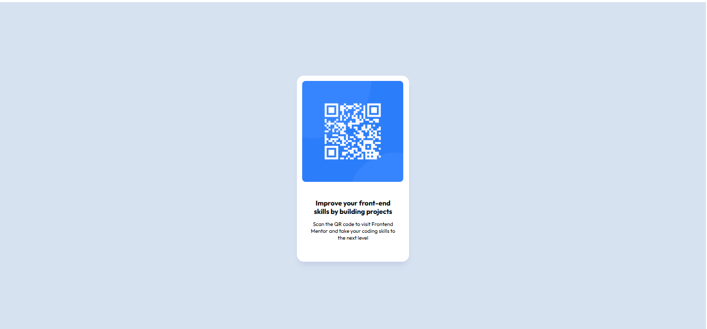

# Frontend Mentor - QR code component solution

This is a solution to the [QR code component challenge on Frontend Mentor](https://www.frontendmentor.io/challenges/qr-code-component-iux_sIO_H). Frontend Mentor challenges help you improve your coding skills by building realistic projects.

## Table of contents

- [Overview](#overview)
  - [Screenshot](#screenshot)
  - [Links](#links)
- [My process](#my-process)
  - [Built with](#built-with)
  - [What I learned](#what-i-learned)
  - [Continued development](#continued-development)
- [Author](#author)

## Overview

A simple Application of Flex in rendering a QR code component, with focus on semantics and BEM.

### Screenshot



### Links

- Solution URL: [Add solution URL here](https://github.com/ibitoy3/QR-Code-Component)
- Live Site URL: [Add live site URL here](https://ibitoy3.github.io/QR-Code-Component/)

## My process

under the body section of the HTML file i created a div element with a background class, acting as the container (I didn't want to use container as the class name because of the new css updates... or so i heard LOL!). The created container was made into a flex, which contained the QR code template with the class wrapper. the wrapper was made up of two other div elements, one for the image and the other fpr the text components. CSS was then used to apply the colours, fonts and arrangements of all the elements.

### Built with

- Semantic HTML5 markup
- CSS custom properties
- Flexbox
- Mobile-first workflow
- BEM

### What I learned

I was able to learn about the basic working principles of a flex displayed object, the conversion of an inline element to a block element and the corresponding effect on the types of attributes that could be applied while formating the said element.

### Continued development

For future projects I will be looking into understanding the benefits and shortcomings of using Flex, and its widespread alternative "Grid". I will also be looking to learn more specialised styling languages and diving into Javascript, to help me with achievieng my goal of becoming a renowned Web Developer.

## Author

- Website - [Ibitoye Ayomide]
- Frontend Mentor - [@ibitoy3](https://www.frontendmentor.io/profile/ibitoy3)

```

```
